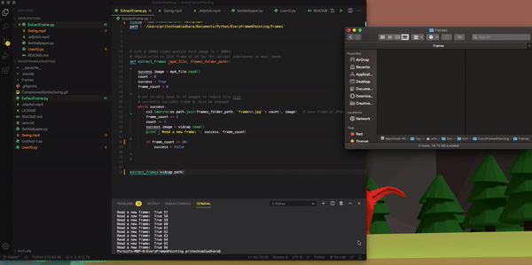

# Every Frame A Painting

Sometimes a movie or video can be so well crafted that every frame may as well be a painting (Such is the case with Spider-man Into the Spider-Verse). The goal of this project is to be able to admire every frame of a clip and be able to use the images as desktop wallpapers. 

# Turn this

# Into These!

# Create Desktop Wallpapers from .MP4s

  - Reads .mp4 files and extracts frames to be used for desktop wallpaper
  - Automatically set desktop background from extracted frames(Currently Mac OS Only) 
 

# ToDo
  - Create Cleaner User Interface
  - Create additional parameters to be controllers via app
  

### Tech
* [OpenCV - Python] (https://pypi.org/project/opencv-python/) - Unofficial pre-built OpenCV packages for Python

License
----

MIT
